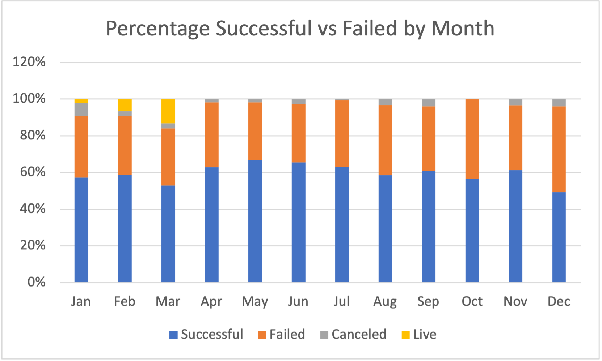
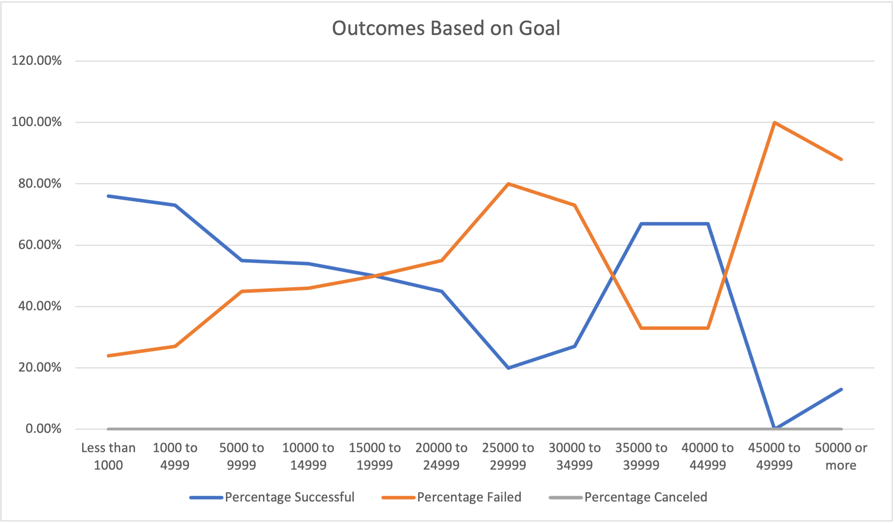

# Kickstarting with Excel

## Overview of Project

 This project is an analysis of data from Kickstarter campaigns using Microsoft Excel. All data, conclusions, and visualizations are stored in [this workbook.](Kickstarter-Challenge.xlsx)

### Purpose

This project is assisting client Louise, who is planning to launch a Kickstarter campaign to fund a theater production. We analyzed similar campaigns launched from 2009 to 2017 to inform Louise's launch regarding timing, fundraising goal, category, and comparisons with specific successful play campaigns.

## Analysis and Challenges

### Analysis of Outcomes Based on Launch Date

This line chart shows the outcomes of theater-related campaigns by month (in any year). The chart was created from a pivot table in Excel filtered by category and year, with months out of the year on one axis and outcome status on the other. As we can see, the largest number of campaigns launched occurs in May, with 166 total campaigns launched. This pattern applies in general to campaigns launched in the middle of the year. These months also show the greatest disparity between successful and failed campaigns. The percentage difference among failed, successful, canceled, and live campaigns can be seen in the chart below. The lowest number of total launches, as well as the lowest proportion of successful launches, is in December.

### Analysis of Outcomes Based on Goals

This graph shows the outcomes of theater-related campaigns based on their stated financial goals. The `COUNTIFS()` function was used to populate a sheet with data from the original dataset conditional on outcome, the "plays" subcategory, and ranges of funding goals. The least successful campaigns in this analysis had launched with a goal of $45,000 or more, while the most successful campaigns had launched with a goal of $5,000 or less. Success trends down steadily as the funding goal increases, with a rise in success rates between $30,000 and $45,000. 

### Challenges and Difficulties Encountered

This challenge utilized skills gained from the lessons in Module 1, but applying them in new ways and extrapolating them to new specific functions went a step further. I had to do some googling to find out how to use the `COUNTIFS()` function. Otherwise, the concepts from the lessons translated intuitively into the challenge material.

## Results

- What are two conclusions you can draw about the Outcomes based on Launch Date?

The trends in the Outcomes based on Launch Date hint that a theater campaign is most likely to be successful if launched between April and August, and least likely to be successful if launched between November and January. The data gathered from this also shows us that more campaigns get launched from April through August in general, in addition to the greater proportion of success. While there may not be a causal relationship between the time of year and likelihood of success, the correlation observed here suggests that the middle of the year would be the best time to launch a campaign.

- What can you conclude about the Outcomes based on Goals?

The most definitive conclusion about the Outcomes based on Goals is that, in a range of less than $1000 to $30,000, smaller goals are more likely to succeed. The rise in success between $35,000 and $45,000 seems surprising; however, there is far less data available at the higher end of the chart than the lower end, and therefore the trends in the higher half are less trustworthy than the lower half. It is possible that, given a more balanced dataset of fundraising goals, the trend of likelihood of success decreasing steadily as the goal increases would be maintained through the whole chart.

- What are some limitations of this dataset?

As discussed above, the imbalance of data for the fundraising goals creates some unreliable apparent trends. In addition, more specific data regarding timing could shed light on the correlation between the time of year and the rate of success.

- What are some other possible tables and/or graphs that we could create?

My chart displaying the percentages of success and failure by month was not part of the challenge, but helped me to further understand the trends in the line chart. We also created a sheet holding data for five specific plays; it could be useful to visualize this data in comparison to the trends of the other theater campaigns to clearly show where those plays lie.
