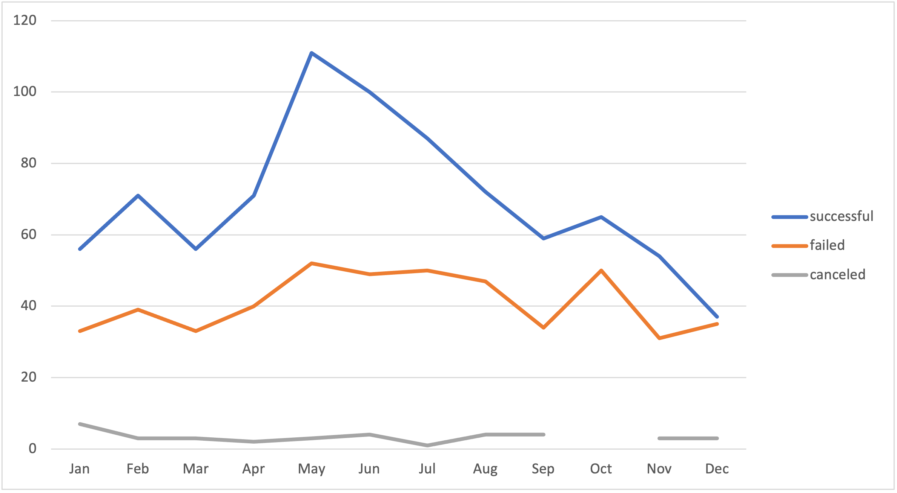
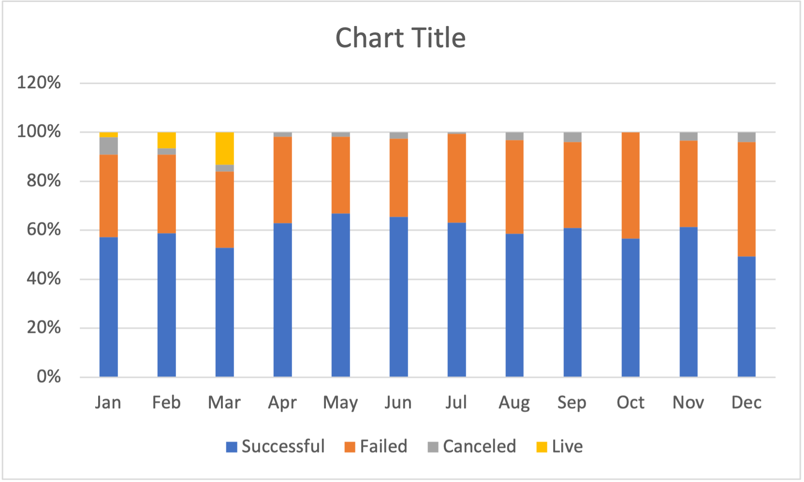

# Kickstarting with Excel

## Overview of Project

 This project is an analysis of data from Kickstarter campaigns using Microsoft Excel. All data, conclusions, and visualizations are stored in [this workbook.](Kickstarter_Challenge.xlsx)

### Purpose

This project is assisting client Louise, who is planning to launch a Kickstarter campaign to fund a theater production. We analyzed similar campaigns launched from 2009 to 2017 to inform Louise's launch regarding timing, fundraising goal, category, and comparisons with specific successful play campaigns.

## Analysis and Challenges

### Analysis of Outcomes Based on Launch Date

This graph shows the outcomes of theater-related campaigns by month (in any year). As we can see, the largest number of campaigns launched occurs in May, with 166 total campaigns launched. This pattern applies in general to campaigns launched in the middle of the year. These months also show the greatest disparity between successful and failed campaigns. The percentage difference among failed, successful, canceled, and live campaigns can be seen in the chart below.

### Analysis of Outcomes Based on Goals

### Challenges and Difficulties Encountered

## Results

- What are two conclusions you can draw about the Outcomes based on Launch Date?

- What can you conclude about the Outcomes based on Goals?

- What are some limitations of this dataset?

- What are some other possible tables and/or graphs that we could create?
